# Projeto Hotel - MariaDB

## MODELAGEM E IMPLEMENTAÇÃO DE BANCO DE DADOS NO MARIADB
Aluna: Larissa de Almeida Rosa
Tema: Hotel
Tecnologia Principal: MariaDB / MySQL

## Sobre o Projeto
Criação da modelagem conceitual, lógica e implementação física de um sistema de banco de dados para gerenciamento de reservas em um hotel. 

## Funcionalidades

- Cadastro de hóspedes
- Controle de quartos
- Gerenciamento de reservas
- Controle de pagamentos
- Tipos de quartos

## Relacionamentos:

- Um hóspede pode fazer várias reservas
- Cada reserva pertence a um único hóspede
- Um quarto pode ficar livre (0) ou ser reservado várias vezes
- Uma reserva sempre está ligada a um único quarto
- Uma reserva gera um ou mais pagamentos
- Cada pagamento pertence a uma única reserva
- Um tipo pode classificar vários quartos
- Um quarto pertence a um único tipo

## MODELAGEM CONCEITUAL (DER)

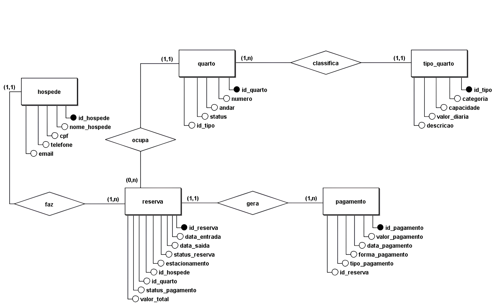

#### CARDINALIDADES:
- Relacionamento: HÓSPEDE → RESERVA

RESERVA (1,N) → um hóspede pode fazer várias reservas

HOSPEDE (1,1) → uma reserva pertence a um hóspede 

- Relacionamento: QUARTO → RESERVA

RESERVA (1,1) → reserva obrigatoriamente usa um quarto 

QUARTO (0,N) → um quarto pode ter nenhuma ou várias reservas ao longo do tempo

- Relacionamento: RESERVA → PAGAMENTO

RESERVA (1,1) → um pagamento pertence a uma única reserva

PAGAMENTO (1,N) → uma reserva deve ter pelo menos 1 pagamento (mínimo, parcial, complementar ou integral)

- Relacionamento: TIPO_QUARTO → QUARTO

QUARTO (1,1) → um quarto tem um único tipo que o classifica

TIPO_QUARTO (1,N) → um tipo pode classificar vários quartos

## MODELAGEM LÓGICA

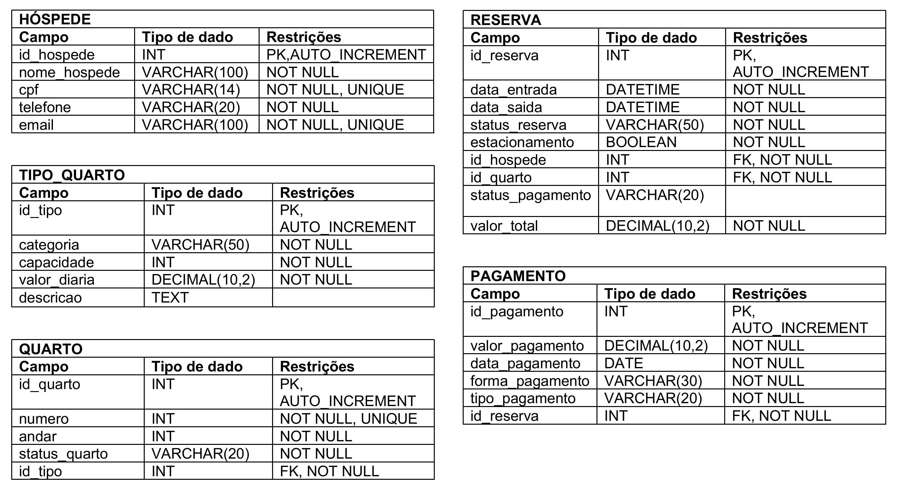

## IMPLEMENTAÇÃO FÍSICA NO MARIADB

- OBSERVAÇÃO: há alguns atributos de algumas tabelas que não serão criados com o comando ‘CREATE TABLE’, eles serão adicionados ou modificados depois com o comando ‘ALTER TABLE’.

### Criando e acessando o banco de dados ‘Hotel’

```sql
CREATE DATABASE hotel;
USE hotel;
```

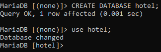

### Criando a tabela hospede

```sql
CREATE TABLE hospede (
    id_hospede INT AUTO_INCREMENT PRIMARY KEY,
    nome_hospede VARCHAR(100) NOT NULL,
    cpf VARCHAR(14) NOT NULL UNIQUE,
    telefone VARCHAR(20) NOT NULL,
    email VARCHAR(100) NOT NULL UNIQUE
);
```

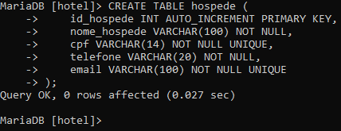

### Criando a tabela tipo_quarto

```sql
CREATE TABLE tipo_quarto (
    id_tipo INT AUTO_INCREMENT PRIMARY KEY,
    categoria VARCHAR(50) NOT NULL,
    capacidade INT NOT NULL,
    valor_diaria DECIMAL(10,2) NOT NULL
);
```

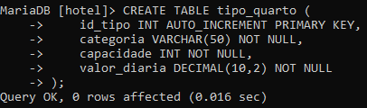

### Criando a tabela quarto

```sql
CREATE TABLE quarto (
    id_quarto INT AUTO_INCREMENT PRIMARY KEY,
    numero INT NOT NULL UNIQUE,
    andar INT NOT NULL,
    status_quarto VARCHAR(20) NOT NULL,
    id_tipo INT NOT NULL,

FOREIGN KEY (id_tipo) REFERENCES tipo_quarto(id_tipo),

CHECK (status_quarto IN ('livre', 'ocupado', 'manutencao'))
);
```

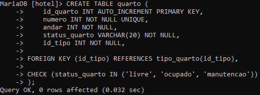

### Criando a tabela reserva

```sql
CREATE TABLE reserva (
    id_reserva INT AUTO_INCREMENT PRIMARY KEY,
    data_entrada DATETIME NOT NULL,
    data_saida DATETIME NOT NULL,
    status_reserva VARCHAR(50) NOT NULL DEFAULT 'pendente',
    estacionamento BOOLEAN NOT NULL DEFAULT FALSE,
    id_hospede INT NOT NULL,
    id_quarto INT NOT NULL,

FOREIGN KEY (id_hospede) REFERENCES hospede(id_hospede),
FOREIGN KEY (id_quarto) REFERENCES quarto(id_quarto),

CHECK (status_reserva IN ('pendente', 'confirmada', 'cancelada')),
CHECK (data_saida > data_entrada)
);
```

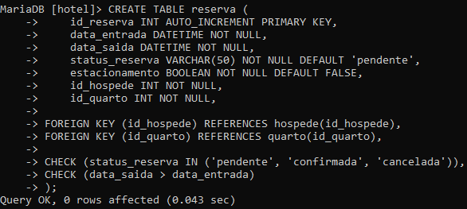

### Criando a tabela pagamento

```sql
CREATE TABLE pagamento (
    id_pagamento INT AUTO_INCREMENT PRIMARY KEY,
    valor_pagamento DECIMAL(10,2) NOT NULL,
    data_pagamento DATE NOT NULL,
    forma_pagamento VARCHAR(15) NOT NULL,
    tipo_pagamento varchar(20) NOT NULL,
    id_reserva INT NOT NULL,

FOREIGN KEY (id_reserva) REFERENCES reserva(id_reserva),

CHECK (forma_pagamento IN ('pix', 'debito', 'credito', 'dinheiro')),
CHECK (tipo_pagamento IN ('minimo', 'parcial', 'complementar', 'integral'))
);
```
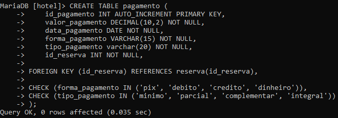

### Inserindo dados na tabela hospede

```sql
INSERT INTO hospede (nome_hospede, cpf, telefone, email) VALUES
('Ana Souza', '111.111.111-11', '21999990001', 'ana@email.com'),
('Bruno Lima', '222.222.222-22', '21999990002', 'bruno@email.com'),
('Carlos Mendes', '333.333.333-33', '21999990003', 'carlos@email.com'),
('Daniela Rocha', '444.444.444-44', '21999990004', 'daniela@email.com'),
('Eduardo Silva', '555.555.555-55', '21999990005', 'edu@email.com'),
('Fernanda Alves', '666.666.666-66', '21999990006', 'fernanda@email.com'),
('Gustavo Pinto', '777.777.777-77', '21999990007', 'gustavo@email.com'),
('Helena Costa', '888.888.888-88', '21999990008', 'helena@email.com'),
('Igor Martins', '999.999.999-99', '21999990009', 'igor@email.com'),
('Juliana Nunes', '101.101.101-10', '21999990010', 'juliana@email.com'),
('Lucas Barros', '121.212.121-21', '21999990011', 'lucas@email.com'),
('Marina Freitas', '131.313.131-31', '21999990012', 'marina@email.com');
```

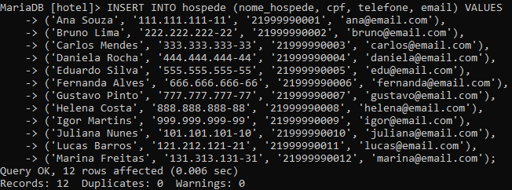

### Consultando a tabela hospede (SELECT)

```sql
SELECT * FROM hospede;
```

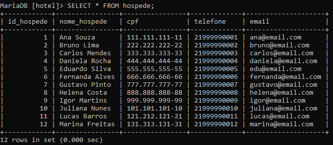

### Inserindo dados na tabela tipo_quarto

```sql
INSERT INTO tipo_quarto (categoria, capacidade, valor_diaria) VALUES
    ('Econômico', 2, 120.00),
    ('Standard', 2, 180.00),
    ('Luxo', 3, 300.00),
    ('Suite', 4, 500.00);
```

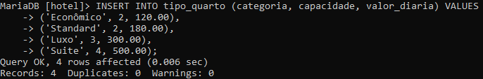

### Adicionando uma nova coluna à tabela tipo_quarto e depois modificando o tipo da coluna nova

```sql
ALTER TABLE tipo_quarto
ADD descrição VARCHAR(100);

ALTER TABLE tipo_quarto
MODIFY descrição TEXT;
```

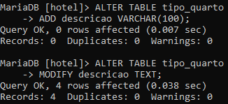

### Atualizando os registros da tabela tipo_quarto

```sql
UPDATE tipo_quarto
SET descricao = 'Quarto para 2 pessoas, com cama de solteiro e itens básicos.'
WHERE id_tipo = 1;

UPDATE tipo_quarto
SET descricao = 'Quarto para 2 pessoas, com cama casal, TV e ar-condicionado.'
WHERE id_tipo = 2;

UPDATE tipo_quarto
SET descricao = 'Quarto para até 3 pessoas, com cama casal e sofá-cama.'
WHERE id_tipo = 3;

UPDATE tipo_quarto
SET descricao = 'Suite para até 4 pessoas, com sala, cama king e conforto elevado.'
WHERE id_tipo = 4;
```

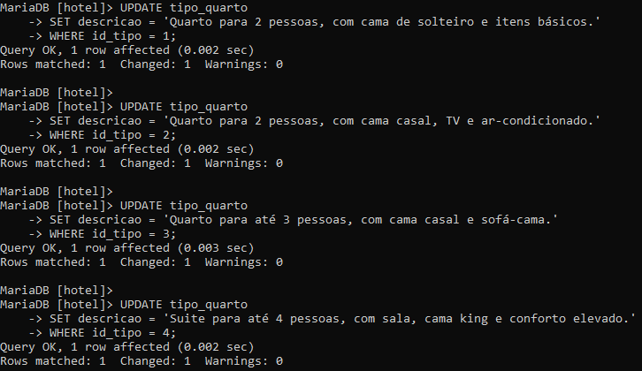

### Consultando a tabela tipo_quarto (SELECT)

```sql
SELECT * FROM tipo_quarto;
```

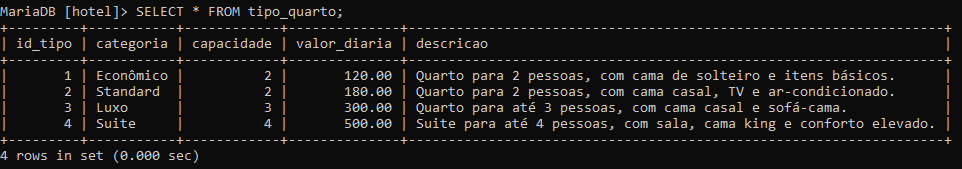

### Inserindo dados na tabela quarto

```sql
INSERT INTO quarto (numero, andar, status_quarto, id_tipo) VALUES
(101, 1, 'livre', 1),
(102, 1, 'ocupado', 2),
(103, 1, 'livre', 3),
(104, 1, 'manutencao', 4),
(201, 2, 'livre', 1),
(202, 2, 'ocupado', 2),
(203, 2, 'livre', 3),
(204, 2, 'livre', 4);

INSERT INTO quarto (numero, andar, status_quarto, id_tipo) VALUES
(301, 3, 'ocupado', 4),
(302, 3, 'livre', 4);
```

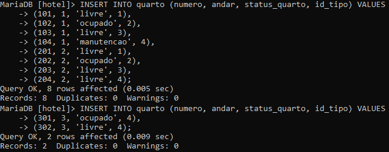

### Atualizando os registros da tabela quarto

```sql
UPDATE quarto
SET id_tipo = 2
WHERE numero = 103;

UPDATE quarto
SET id_tipo = 3
WHERE numero = 104;

UPDATE quarto
SET id_tipo = 2
WHERE numero = 203;

UPDATE quarto
SET id_tipo = 3
WHERE numero = 204;
```

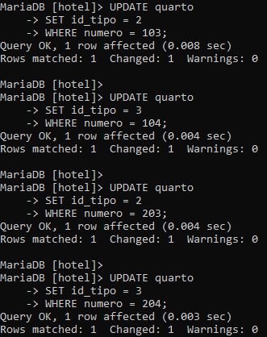

### Consultando a tabela quarto (SELECT)

```sql
SELECT * FROM quarto;
```

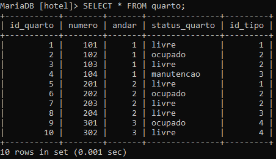

### Inserindo dados na tabela reserva

```sql
INSERT INTO reserva
(data_entrada, data_saida, status_reserva, estacionamento, id_hospede, id_quarto) 
VALUES
('2026-06-01 14:00:00', '2026-06-03 12:00:00', 'confirmada', TRUE, 1, 1),
('2026-06-02 14:00:00', '2026-06-04 12:00:00', 'pendente', FALSE, 2, 3),
('2026-06-01 14:00:00', '2026-06-04 12:00:00', 'confirmada', FALSE, 3, 5),
('2026-06-05 14:00:00', '2026-06-07 12:00:00', 'confirmada', FALSE, 4, 7),
('2026-06-07 14:00:00', '2026-06-09 12:00:00', 'confirmada', TRUE, 5, 8),
('2026-06-05 14:00:00', '2026-06-08 12:00:00', 'pendente', TRUE, 6, 10);
```

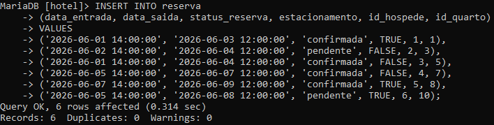

### Removendo uma coluna da tabela reserva

```sql
ALTER TABLE reserva
DROP COLUMN status_reserva;
```

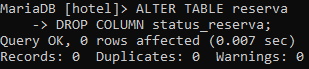

### Adicionando uma nova coluna à tabela reserva

```sql
ALTER TABLE reserva
ADD status_pagamento VARCHAR(20) 
CHECK (status_pagamento IN ('completo', 'parcial'));
```

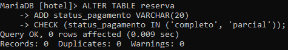

### Atualizando os registros da tabela reserva

```sql
UPDATE reserva
SET status_pagamento = 'completo'
WHERE id_reserva = 1;

UPDATE reserva
SET status_pagamento = 'completo'
WHERE id_reserva = 3;

UPDATE reserva
SET status_pagamento = 'completo'
WHERE id_reserva = 4;

UPDATE reserva
SET status_pagamento = 'completo'
WHERE id_reserva = 5;

UPDATE reserva
SET status_pagamento = 'parcial'
WHERE id_reserva = 2;

UPDATE reserva
SET status_pagamento = 'parcial'
WHERE id_reserva = 6;
```

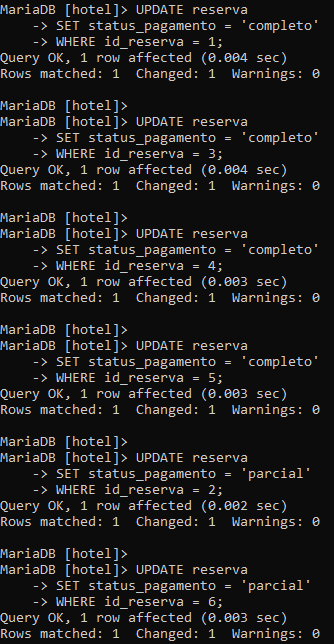

### Adicionando uma nova coluna à tabela reserva

```sql
ALTER TABLE reserva
ADD valor_total DECIMAL(10,2) NOT NULL DEFAULT 0.00;
```

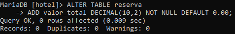

### Atualizando  registros da tabela reserva juntamente com o comando de junção (UPDATE + JOIN)

```sql
UPDATE reserva r
    JOIN quarto q ON r.id_quarto = q.id_quarto
    JOIN tipo_quarto tq ON q.id_tipo = tq.id_tipo
    SET r.valor_total = tq.valor_diaria * 
        (TIMESTAMPDIFF(DAY, r.data_entrada, r.data_saida) + 1);

SELECT * FROM reserva;
```

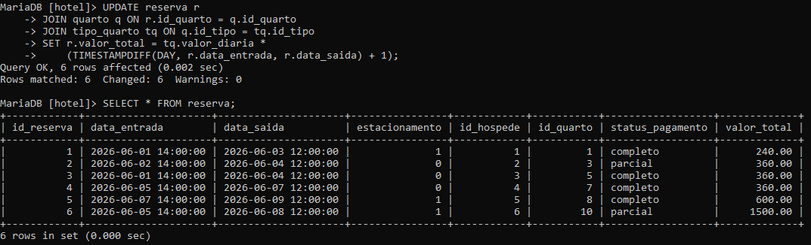

### Inserindo dados na tabela pagamento

```sql
INSERT INTO pagamento
(valor_pagamento, data_pagamento, forma_pagamento, tipo_pagamento, id_reserva) 
VALUES
(240.00, '2026-06-01', 'pix', 'integral', 1),
(180.00, '2026-06-01', 'credito', 'minimo', 2),
(360.00, '2026-06-01', 'debito', 'integral', 3),
(360.00, '2026-06-03', 'pix', 'integral', 4),
(600.00, '2026-06-01', 'dinheiro', 'integral', 5),
(1250.00, '2026-06-04', 'credito', 'parcial', 6);
```

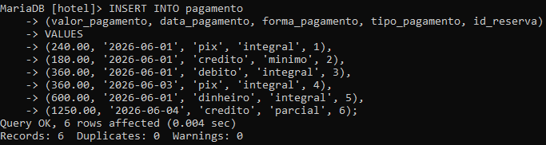

### Consultando a tabela pagamento (SELECT)

```sql
SELECT * FROM pagamento;
```

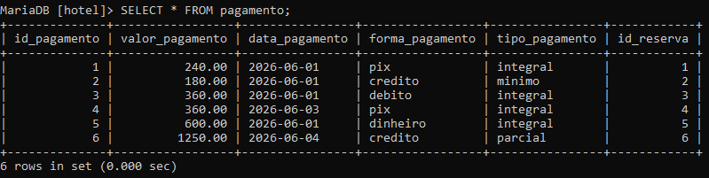

### Consulta (SELECT) à tabela reserva com ALIAS e cláusula WHERE

```sql
SELECT
    id_reserva,
    id_hospede,
    data_entrada
    'sim' AS estacionamento
FROM reserva
WHERE estacionamento = 1;
```

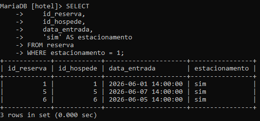

### Consultando mais de uma tabela (INNER JOIN) com cláusula WHERE

```sql
SELECT
    r.id_reserva,
    r.id_hospede,
    h.nome_hospede,
    r.data_entrada,
    'sim' AS estacionamento
FROM reserva r
INNER JOIN hospede h 
    ON r.id_hospede = h.id_hospede
WHERE r.estacionamento = 1;
```

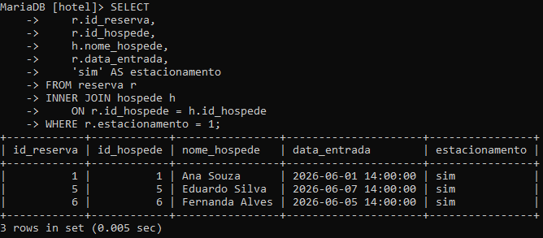

### Consulta ordenada

```sql
SELECT * 
FROM reserva
ORDER BY data_entrada ASC;
```

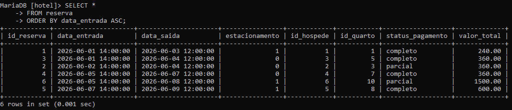

### Consulta ordenada

```sql
SELECT *
FROM pagamento
ORDER BY valor_pagamento DESC;
```

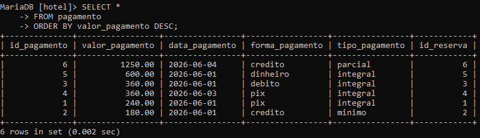

### Consulta utilizando o operador LIKE

```sql
SELECT *
    FROM quarto
    WHERE status_quarto LIKE '%ocupado%';
```

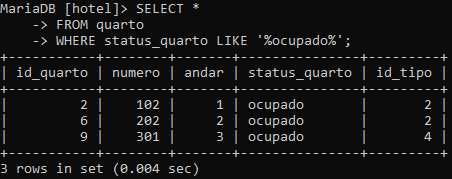

### Consulta utilizando o operador LIKE

```sql
SELECT *
    FROM quarto
    WHERE status_quarto LIKE '%ocupado%'
        OR status_quarto LIKE '%manutencao%';
```

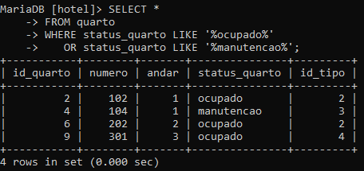

### Consulta utilizando o operador BETWEEN

```sql
SELECT *
FROM reserva
WHERE data_saida BETWEEN '2026-06-07 00:00:00' 
                      AND '2026-06-09 23:59:59';
```

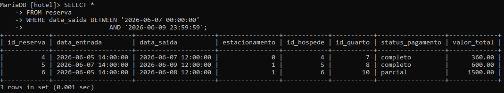

### Consulta utilizando o operador IN

```sql
SELECT *
FROM reserva
WHERE id_quarto IN (
    SELECT id_quarto
    FROM quarto
    WHERE id_tipo = 2
);
```

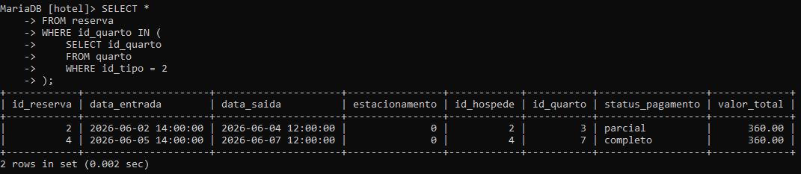

### Consulta a mais de uma tabela (INNER JOIN)

```sql
SELECT
    r.id_reserva,
    r.data_entrada,
    r.data_saida,
    q.numero AS numero_quarto,
    tq.categoria
FROM reserva r
INNER JOIN quarto q ON r.id_quarto = q.id_quarto
INNER JOIN tipo_quarto tq ON q.id_tipo = tq.id_tipo;
```

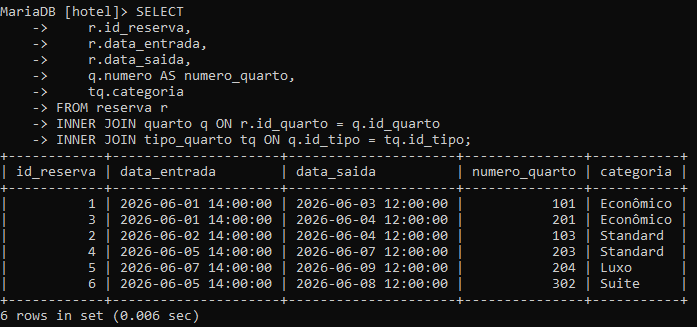

### Consulta a mais de uma tabela (LEFT JOIN)

```sql
SELECT
    h.id_hospede,
    h.nome_hospede,
    h.cpf,
    r.id_reserva,
    r.data_entrada,
    r.data_saida,
    r.id_quarto
FROM hospede h
LEFT JOIN reserva r 
    ON h.id_hospede = r.id_hospede;
```

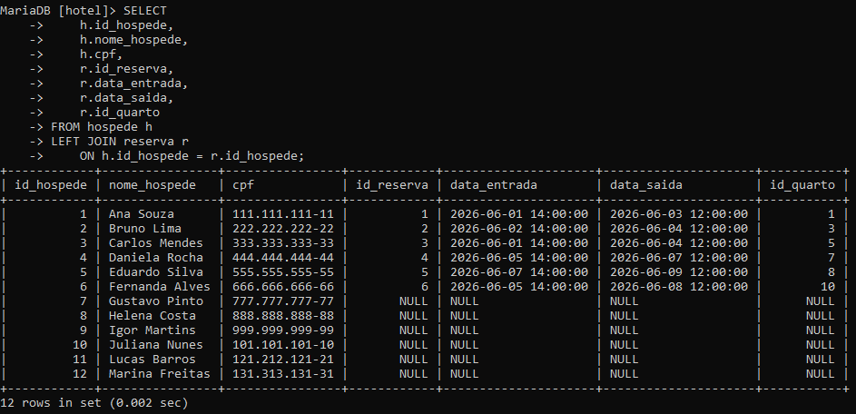

### Consulta a mais de uma tabela (RIGHT JOIN)

```sql
SELECT
    h.id_hospede,
    h.nome_hospede,
    h.cpf,
    r.id_reserva,
    r.data_entrada,
    r.data_saida,
    r.id_quarto
FROM hospede h
RIGHT JOIN reserva r
    ON h.id_hospede = r.id_hospede;
```

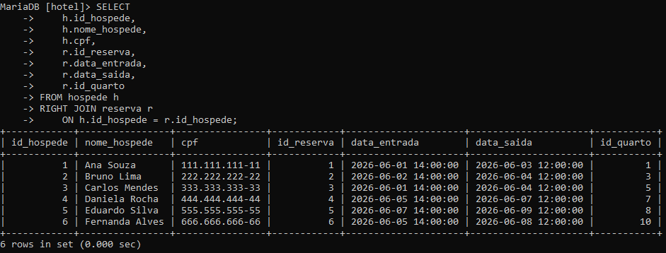

### Renomeando uma coluna da tabela hospede

```sql
ALTER TABLE hospede
CHANGE email `e-mail` VARCHAR(90) NOT NULL;
```

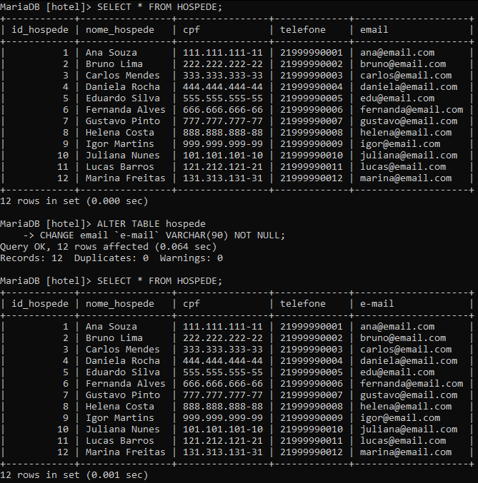

### Deletando registros da tabela hospede

```sql
DELETE FROM hospede
WHERE id_hospede = 11;

DELETE FROM hospede
WHERE id_hospede = 12;
```

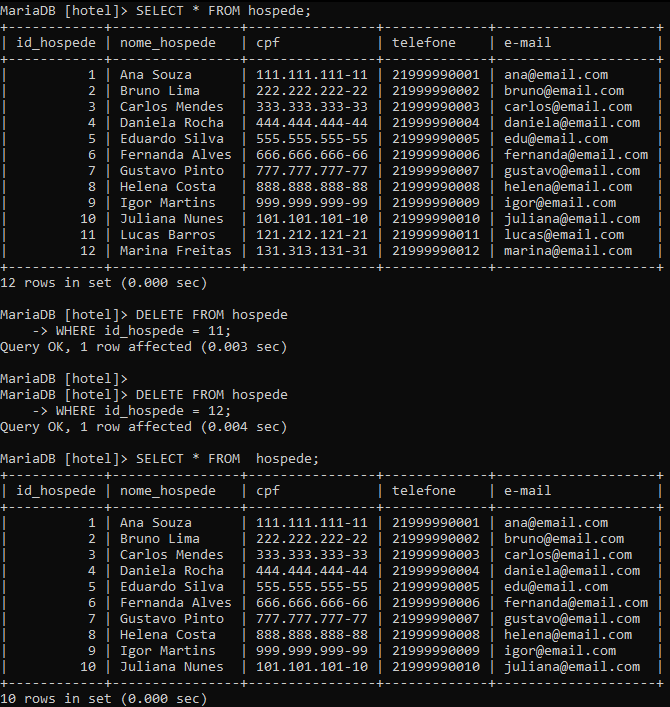

### Apagando tabela teste_drop utilizando o comando DROP

```sql
DROP TABLE teste_drop;
```

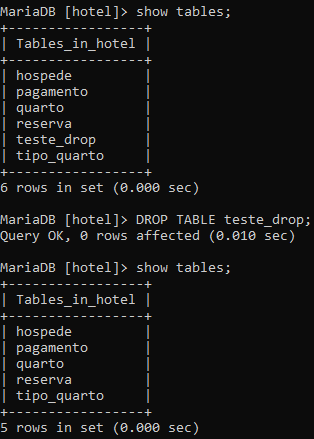

### Apagando database test utilizando o comando DROP

```sql
DROP DATABASE test;
```

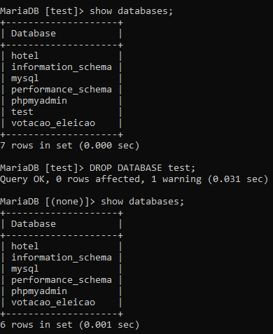
